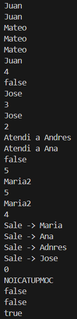
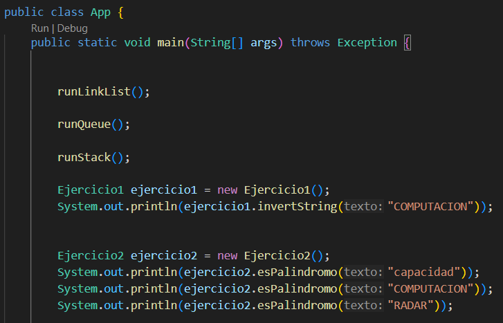
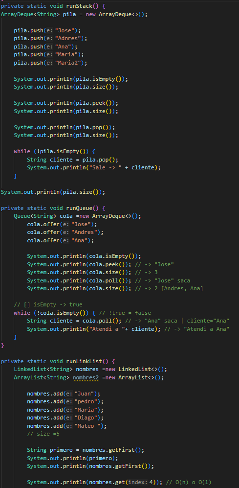
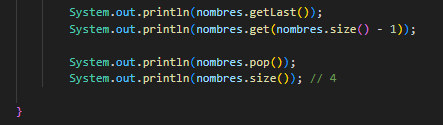
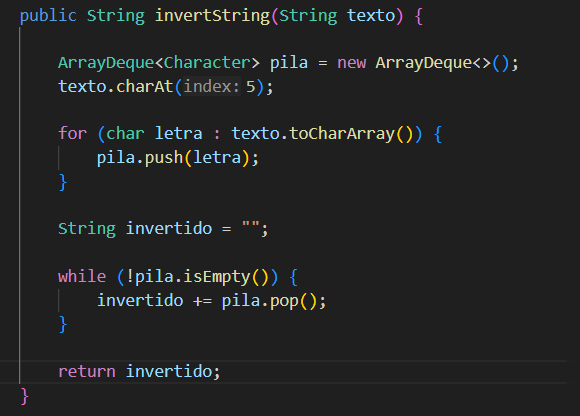
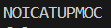
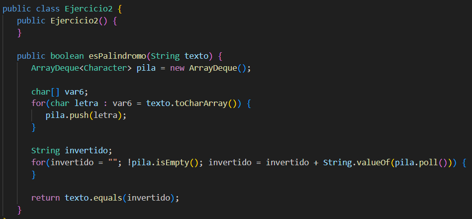
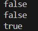

# Práctica: Estructuras Dinámicas Lineales

## Datos del Estudiante
- **Nombre:** [ Michelle Marca ]
- **Curso:** [ Estructura de Datos ]
- **Fecha:** [ 09 de Junio del 2026 ]

---

## 1. Implementación de estructuras dinámicas lineales

**Fecha:** [9 de junio del 2026 ]

**Descripción:**

En esta clase se implementaron estructuras dinámicas lineales utilizando Java. Se trabajó con LinkedList, Queue y ArrayDeque para comprender las operaciones básicas de inserción, eliminación, consulta y recorrido de elementos

### Captura de salida en consola

![Captura de salida en consola]

### Captura de App.java

### Captura del código de implementación del ejercicio 1

**Descripción:**
Se implemento el metodo de invertir el texto o palabra en este caso por medio de la utilizacion de una pila. Esto es posible ya que cada caracter del texto se lo almacena o guarda en una pila para despues extraerla para formar la palabra invertida.

![Captura del código de implementación]

![Captura de salida en consola]

## 2. Ejercicio Palíndromo

**Fecha:** [Fecha en la que se realizó la práctica]

**Descripción:**
...... 
Se implento el metodo palindromo, esto se hizo utilizando una pila con la cual invertimos el texto y lo comparamos con el texto original.
### Método implementado

![Captura de salida en consola]

